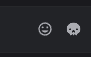
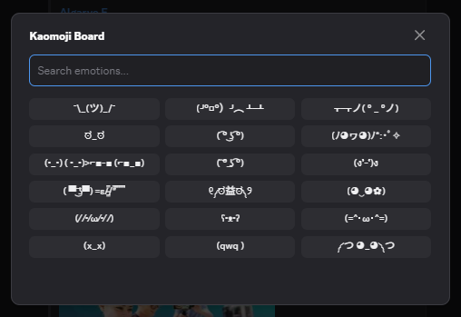
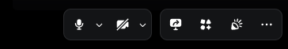
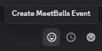
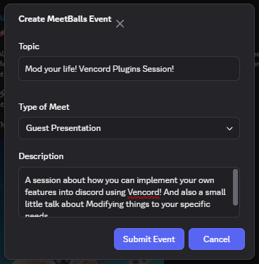
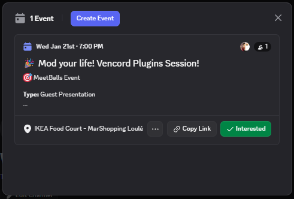
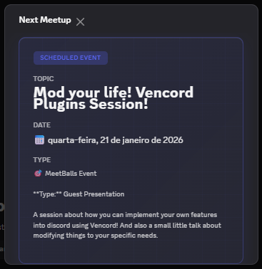

# Let's create a plugin!

## 🚀 So how does it work?
Discord ships it's code to the user in minified javascript modules that update from a server on every startup. Vencord's task is to intercept and edit them with new, custom code.

This means we need to have a somewhat-good understanding of how the client is made. Not! With some *finaegling* we can dig through the react components and minified code to find what we need.

Or if you just like that stress-free life, you can stick to the built-in tools that Vencord gives you!

If you want a quick-start guide to creating plugins yourself, here's an outdated (but still mostly valid) [guide](https://gist.github.com/sunnniee/28bd595f8c07992f6d03289911289ba8) from [@sunnnie](https://github.com/sunnniee) on how to create one. (it's basically what'll be showcased here)

The main outline to doing it is as follows:
1. **Research:** Look through the React Component Structure and identify any structure we can later find through `regex`
2. **Boilerplate:** In the entrypoint (index.ts), define metadata for the plugin (and configure a settings page, more on that later)
3. **Logic:** Depending on the goal of the plugin, create code that makes discord do what you want.
4. **UI:** Using the patches feature (or not, more on that later), inject custom React Components that integrate with your logic.
5. **Enjoy** what you made.

Today we'll create a simple Kaomoji board. Assert dominance over those who need to waste 3 seconds on google to pick one. 😆

This is kaomoji:


## 1. Boilerplate 

In `Vencord/src/userplugins/`, create a new folder called `mb-kaomoji`. This is where we'll keep the files for our plugin.

Next, create an `index.tsx` file. This is the first file Vencord loads.
All index files must have this structure:

```tsx
import definePlugin from "@utils/types";

export default definePlugin({
    name: "MB-Kaomoji",
    description: "The very cool Kaomoji board from the MeetBalls Session",
    authors: [{ name: "Your Name", id: 123456789n }], //your discord userId with n at the end
    //the id is just for credit purposes, it appears on the info page of your plugin
});
```

---
**Note:** if you want to publish your plugin, you must use the `plguins/[pluginName]` folder instead, add your name to the Devs struct in `@utils/constants` and use this format instead:
(please keep it in alphabetical order, and make sure you follow their ESLint rules)

```tsx
export default definePlugin({
    name: "MB-Kaomoji",
    description: "The very cool Kaomoji board from the MeetBalls Session",
    authors: [Devs.theThingYouDefined],
});
```
---

What does our menu system mean if we don't have content to put there? Let's define our Kaomojis.
(be careful with both file encoding and the `\` escape)

```tsx
const kaomojiData = [
  // --- The Classics (Essential for survival) ---
  { name: "The Shrug", content: "¯\\_(ツ)_/¯" },
  { name: "Table Flip", content: "(╯°□°）╯︵ ┻━┻" },
  { name: "Table Un-Flip", content: "┬─┬ノ( º _ ºノ)" },
  { name: "Disapproval", content: "ಠ_ಠ" },

  // --- The "Vibes" (For when words fail) ---
  { name: "Lenny", content: "( ͡° ͜ʖ ͡°)" },
  { name: "Magic/Sparkle", content: "(ﾉ◕ヮ◕)ﾉ*:･ﾟ✧" },
  { name: "Cool/Sunglasses", content: "(•_•) ( •_•)>⌐■-■ (⌐■_■)" },
  { name: "Thinking/Sus", content: "( ͠° ͟ʖ ͡°)" },
  
  // --- Aggressive / Action ---
  { name: "Square Up", content: "(ง'̀-'́)ง" },
  { name: "Gun", content: "( ▀ ͜͞ʖ▀) =ε/̵͇̿/’̿’̿ ̿ ̿̿ ̿̿ ̿" },
  { name: "Riot", content: "୧༼ಠ益ಠ༽୨" },
  
  // --- Cute / Wholesome ---
  { name: "Flower Girl", content: "(◕‿◕✿)" },
  { name: "Blushing", content: "(⁄ ⁄•⁄ω⁄•⁄ ⁄)" },
  { name: "Bear", content: "ʕ•ᴥ•ʔ" },
  { name: "Cat", content: "(=^･ω･^=)" },
  
  // --- The "I'm Done" Collection ---
  { name: "Dead", content: "(x_x)" },
  { name: "Crying", content: "(qwq )" },
  { name: "Giving Energy", content: "༼ つ ◕_◕ ༽つ" }
];
```

Great! Now we have things to throw into conversations. For the sake of simplicity, we're going to mimic the behaviour of the already existing emoji panel. For this we need to add a button to the chat bar:

```tsx
// we need to update the imports for this
import { ChatBarButton, ChatBarButtonFactory } from "@api/ChatButtons";
import definePlugin, { IconComponent } from "@utils/types";

const kaomojiData = [
  // --- The Classics (Essential for survival) ---
  { name: "The Shrug", content: "¯\\_(ツ)_/¯" },
  { name: "Table Flip", content: "(╯°□°）╯︵ ┻━┻" },
  { name: "Table Un-Flip", content: "┬─┬ノ( º _ ºノ)" },
  { name: "Disapproval", content: "ಠ_ಠ" },

  // --- The "Vibes" (For when words fail) ---
  { name: "Lenny", content: "( ͡° ͜ʖ ͡°)" },
  { name: "Magic/Sparkle", content: "(ﾉ◕ヮ◕)ﾉ*:･ﾟ✧" },
  { name: "Cool/Sunglasses", content: "(•_•) ( •_•)>⌐■-■ (⌐■_■)" },
  { name: "Thinking/Sus", content: "( ͠° ͟ʖ ͡°)" },

  // --- Aggressive / Action ---
  { name: "Square Up", content: "(ง'̀-'́)ง" },
  { name: "Gun", content: "( ▀ ͜͞ʖ▀) =ε/̵͇̿/’̿’̿ ̿ ̿̿ ̿̿ ̿" },
  { name: "Riot", content: "୧༼ಠ益ಠ༽୨" },

  // --- Cute / Wholesome ---
  { name: "Flower Girl", content: "(◕‿◕✿)" },
  { name: "Blushing", content: "(⁄ ⁄•⁄ω⁄•⁄ ⁄)" },
  { name: "Bear", content: "ʕ•ᴥ•ʔ" },
  { name: "Cat", content: "(=^･ω･^=)" },

  // --- The "I'm Done" Collection ---
  { name: "Dead", content: "(x_x)" },
  { name: "Crying", content: "(qwq )" },
  { name: "Giving Energy", content: "༼ つ ◕_◕ ༽つ" }
];

// we also need an icon for the button
export const KmIcon: IconComponent = ({ height = 20, width = 20, className }) => {
    return (
        <svg
            role="img"
            width={width}
            height={height}
            className={className}
            viewBox="0 0 24 24"
        >
            <path fill="currentColor" d="M12 2C6.48 2 2 6.48 2 12s4.48 10 10 10 10-4.48 10-10S17.52 2 12 2zm0 18c-4.42 0-8-3.58-8-8s3.58-8 8-8 8 3.58 8 8-3.58 8-8 8zm3.5-9c.83 0 1.5-.67 1.5-1.5S16.33 8 15.5 8 14 8.67 14 9.5s.67 1.5 1.5 1.5zm-7 0c.83 0 1.5-.67 1.5-1.5S9.33 8 8.5 8 7 8.67 7 9.5 7.67 11 8.5 11zm3.5 6.5c2.33 0 4.31-1.46 5.11-3.5H6.89c.8 2.04 2.78 3.5 5.11 3.5z" />
        </svg>
    );
};

// create the button
const KmButton: ChatBarButtonFactory = ({ isMainChat }) => {
    if (!isMainChat) return null;

    return (
        <>
            <ChatBarButton
                tooltip="Kaomoji Board"
                onClick={()=>{}} // no action just yet
            >
                    {/*it's just an svg inside a button*/}
                    <KmIcon />
            </ChatBarButton>
        </>
    );
};

export default definePlugin({
    name: "MB-Kaomoji",
    description: "The very cool Kaomoji board from the MeetBalls Session",
    authors: [{ name: "Zinix", id: 495542786263613452n }], // your discord userId with n at the end

    // edit the plugin definition to include the button
    chatBarButton: {
        icon: KmIcon,
        render: KmButton
    }
});
```

After updating the code, run `pnpm build --dev` and reload your discord/vesktop with `[CTRL] + [R]`.

A wild *`BUTTON`* has appeared!



Right now it itsn't much fun, so let's add a menu to it.
For this, we can use the `openModal` function from the Vencord API.
(ideally, we would by now start to fragment our files to make this more readable)

```tsx
//update the imports
import { ChatBarButton, ChatBarButtonFactory } from "@api/ChatButtons";
import { Button } from "@components/Button";
import { insertTextIntoChatInputBox } from "@utils/discord";
import { ModalCloseButton, ModalContent, ModalHeader, ModalRoot, ModalSize,openModal } from "@utils/modal";
import definePlugin, { IconComponent } from "@utils/types";
import { TextInput, Tooltip } from "@webpack/common";
import { useState } from "@webpack/common/react";

const kaomojiData = [
    // --- The Classics (Essential for survival) ---
    { name: "The Shrug", content: "¯\\_(ツ)_/¯" },
    { name: "Table Flip", content: "(╯°□°）╯︵ ┻━┻" },
    { name: "Table Un-Flip", content: "┬─┬ノ( º _ ºノ)" },
    { name: "Disapproval", content: "ಠ_ಠ" },

    // --- The "Vibes" (For when words fail) ---
    { name: "Lenny", content: "( ͡° ͜ʖ ͡°)" },
    { name: "Magic/Sparkle", content: "(ﾉ◕ヮ◕)ﾉ*:･ﾟ✧" },
    { name: "Cool/Sunglasses", content: "(•_•) ( •_•)>⌐■-■ (⌐■_■)" },
    { name: "Thinking/Sus", content: "( ͠° ͟ʖ ͡°)" },

    // --- Aggressive / Action ---
    { name: "Square Up", content: "(ง'̀-'́)ง" },
    { name: "Gun", content: "( ▀ ͜͞ʖ▀) =ε/̵͇̿/’̿’̿ ̿ ̿̿ ̿̿ ̿" },
    { name: "Riot", content: "୧༼ಠ益ಠ༽୨" },

    // --- Cute / Wholesome ---
    { name: "Flower Girl", content: "(◕‿◕✿)" },
    { name: "Blushing", content: "(⁄ ⁄•⁄ω⁄•⁄ ⁄)" },
    { name: "Bear", content: "ʕ•ᴥ•ʔ" },
    { name: "Cat", content: "(=^･ω･^=)" },

    // --- The "I'm Done" Collection ---
    { name: "Dead", content: "(x_x)" },
    { name: "Crying", content: "(qwq )" },
    { name: "Giving Energy", content: "༼ つ ◕_◕ ༽つ" }
];

export const KmIcon: IconComponent = ({ height = 20, width = 20, className }) => {
    return (
        <svg
            role="img"
            width={width}
            height={height}
            className={className}
            viewBox="0 0 24 24"
        >
            <path fill="currentColor" d="M12 2C6.48 2 2 6.48 2 12s4.48 10 10 10 10-4.48 10-10S17.52 2 12 2zm0 18c-4.42 0-8-3.58-8-8s3.58-8 8-8 8 3.58 8 8-3.58 8-8 8zm3.5-9c.83 0 1.5-.67 1.5-1.5S16.33 8 15.5 8 14 8.67 14 9.5s.67 1.5 1.5 1.5zm-7 0c.83 0 1.5-.67 1.5-1.5S9.33 8 8.5 8 7 8.67 7 9.5 7.67 11 8.5 11zm3.5 6.5c2.33 0 4.31-1.46 5.11-3.5H6.89c.8 2.04 2.78 3.5 5.11 3.5z" />
        </svg>
    );
};

// create the modal React Component
const KmModal = ({ onClose, transitionState }: { onClose: () => void, transitionState: any }) => {
    const [searchTerm, setSearchTerm] = useState("");

    // filter the kmoji dataset for the search term by lowercase name
    const filtered = kaomojiData.filter(k =>
        k.name.toLowerCase().includes(searchTerm.toLowerCase())
    );

    return (
        <ModalRoot transitionState={transitionState} size={ModalSize.MEDIUM}>
            <ModalHeader separator={false}>
                <div style={{ display: "flex", justifyContent: "space-between", alignItems: "center", width: "100%" }}>
                    {/* due to a bug in Vencord, we have to set text colors manually */}
                    <h2 style={{ color: "white", fontWeight: "bold", margin: 0 }}>
                        Kaomoji Board
                    </h2>
                    <ModalCloseButton onClick={onClose} />
                </div>
            </ModalHeader>

            <ModalContent style={{ paddingBottom: "16px" }}>
                {/* search bar */}
                <TextInput
                    placeholder="Search Kaomoji..."
                    autoFocus={true}
                    value={searchTerm}
                    onChange={setSearchTerm}
                    style={{ marginBottom: "16px" }}
                />

                <div style={{
                    display: "grid",
                    gridTemplateColumns: "repeat(3, 1fr)",
                    gap: "8px",
                }}>
                    {/* create a button for every kmoji found */}
                    {filtered.map(k => (
                        <Tooltip text={k.name} key={k.name}>
                            {(props: any) => (
                                <Button
                                    {...props}
                                    color="primary"
                                    variant="filled"
                                    size="small"
                                    onClick={() => {
                                        {/* helper function from Vencord to inject text into the ChatBox */}
                                        insertTextIntoChatInputBox(k.content);
                                        onClose();
                                    }}
                                >
                                    <span style={{ whiteSpace: "nowrap", overflow: "hidden", textOverflow: "ellipsis" }}>
                                        {k.content}
                                    </span>
                                </Button>
                            )}
                        </Tooltip>
                    ))}
                    {/* show a message if no kmoji found for the search */}
                    {filtered.length === 0 && (
                        <div style={{ gridColumn: "span 3", textAlign: "center", color: "var(--text-muted)", padding: "20px" }}>
                            No vibes found ¯\\_(ツ)_/¯
                        </div>
                    )}
                </div>
            </ModalContent>
        </ModalRoot>
    );
};

const KmButton: ChatBarButtonFactory = ({ isMainChat }) => {
    if (!isMainChat) return null;

    return (
        <ChatBarButton
            tooltip="Kaomoji Board"
            onClick={() => openModal(props => <KmModal {...props} />)}
        >
            <KmIcon />
        </ChatBarButton>
    );
};

export default definePlugin({
    name: "MB-Kaomoji",
    description: "The very cool Kaomoji board from the MeetBalls Session",
    authors: [{ name: "Zinix", id: 495542786263613452n }],
    chatBarButton: {
        icon: KmIcon,
        render: KmButton
    }
});
```

Hopefully your brain survived the React shenanigans (don't ask me what a ...props is `:[`)

 ~~javascript~~ **typescript/react**

Alright, back to what's important. If you run `pnpm build --dev` again and reload, you should be able to open the modal and choose a kaomoji to send!



And theoretically, you can add as many kmoji as your hard drive can handle. (~4 Unreal Engine games)

## Other features

#### Patches

You can use patches to inject code into any part of discord, whether it's  🤫 *client-side nitro features* (did you know discord doesn't validate the resolution you screenshare at?) or a custom component in a voice channel window.

This is what it looks like. After digging through minified code, and spending too many hours in a regex editor, 

```ts
{
    find: "center-control-tray",
    replacement: {
        match: /\i.eventPromptsContainer.*?ref:\i.*?\i.wrapper.*?children:\[/,
        replace: "$&$self.VCscPanel(),"
    }
}
```
The first field finds the module in the minified discord code that contains the string `center-control-tray` (which, in the original source code, would be named something like `voiceChatWindow.tsx`, and manages everything inside that part, even audio devices, from what I saw in the code).

Then, in the replacement, we can use regex to find the start (or the end) of an element array, and we inject the custom component from our plugin. The code should look like this:

```tsx
// some function in the source code returns a div with many children
// this is part of the code that renders that bottom panel when you're in a voice chat
return V ? (0, r.jsx)(j.Gt, {
    value: J,
    children: 
        (0, r.jsxs)(b.Z, {
        // they call it VOICE_CONTROL_TRAY internally
        section: ev.jXE.VOICE_CONTROL_TRAY, children: [
            // the voice control tray div
            (0, r.jsx)("div", { 
                className: ex.eventPromptsContainer, 
                children: 
                    // some kind of tag that follows every single div that exists
                    // in this damn platform
                    (0, r.jsx)(k.Z, { channelId: n.id }) }), 
                    (0, r.jsxs)("div", {
                        ref: f, 
                        className: a()(ex.wrapper, l), 
                        children: [
                            // before the other content, inject our component
                            // into the div
                            Vencord.Plugins.plugins["YourPlugin"].CustomPanel(),
                            //put the rest back 
                            (0, r.jsxs)("div", { className: ex.buttonSection, 
```
The result would be a new Button before the other button tray:
(It was working before, but then discord updated and that vencord doesn't work anymore. I still don't know the proper way to update a fork, imagine a button there. Git rebase is hard ok... 👉👈😔)


Another very close example of this use case is [this project](https://github.com/gitomatikus/Vencord-popoutplus/tree/feat/popout-plus), it's somewhat close to what I was trying to do originally.

## The Final Coun... Showcase

The MeetBalls Plugin! You can now easily view information about the next meetup with a single button click in your favourite chat app!

Features:
Easily create a new Session!

 

And see when the next one is!


### How it works

When you create an event, it takes all the data you put in, and uses an internal (only-client-accessible) REST API to create an event in the discord server you are currently in, then pastes a messare ready for you to send with the event information.

It's highly configurable and simple enough to change without ghCopilot.